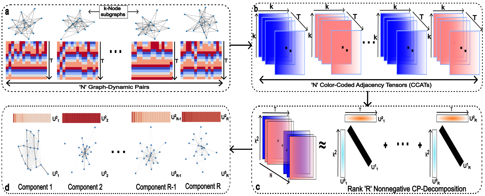

<h1 align="center">Nonnegative CP-Decomposition for Dynamical Systems</h1>
<p align="center">Agam Goyal<sup>1</sup>, Hanbaek Lyu<sup>2</sup></p>
<p align="center"><sup>1</sup> Department of Computer Science,<sup>2</sup> Department of Mathematics</p>
<p align="center">University of Wisconsin - Madison</p>
<!-- <p align="center">
  <a href="https://github.com/AGoyal0512/NCPD-Dynamics" alt="ArXiv">
        </a>
</p> -->

<p align="center">
  
</p>

We propose to utilize an interpretable unsupervised feature extraction method of *nonnegative CP tensor decomposition* (NCPD) to extract key spatiotemporal patterns of emergence at subgraph level. That is, we first sample a large number of dynamics on medium-sized subgraphs and encode them as a three-dimensional tensor and then apply NCPD to learn a few snapshots of dynamics on certain subgraph patterns and their temporal evolution by using NCPD. We study the *firefly cellular automata* (FCA) of discrete pulse-coupled oscillators and *Hegselmann-Krause* (HK) model for opinion dynamics on synthetic networks generated by the Newman-Watts-Strogatz model and the Barabási-Albert (BA) networks. We demonstrate that our proposed method is able to key spatiotemporal patterns in these complex dynamics on networks. 


## How to use this repository?

This repository is structured in the following manner:

```
-- plotting
    -- plot_factors.py: Plotting script to plot the atoms obtained from NCPD.
-- scripts
    -- opinion_datagen.py: Data generation script for Opinion Dynamics. Currently supports Hegselmann-Krause (HK) dynamics.
    -- oscillator_datagen.py: Data generation script for Coupled Oscillator Dynamics. Currently supports Firefly Cellular Automata (FCA) and Kuramoto dynamics.
-- utils
    -- __init__.py: Allows using the utils directory as a package.
    -- CO_utils.py: Utilities and functions to generate the Coupled Oscillator Dynamics data.
    -- OD_utils.py: Utilities and functions to generate the Opinion Dynamics data.
    -- helper.py: Script that contains some helper functions used in other scripts.
-- main.py: Main file that runs the NCPD algorithm to decompose the data tensor and obtain the factors for further utilization and analysis.
```

In order to generate data, for example data tensor for Firefly Cellular Automata (FCA) simulated on 2500 different 20-node subgraphs sampled from a large 450-node Newman-Watts-Strogatz (NWS) parent subgraph with default save directory and seed, run the following command:

```
python3 scrips/oscillator_datagen.py -m FCA -n NWS -k 20 
```

Next, in order to utilize this data tensor generated above and apply Rank-4, Rank-8, and Rank-12 Nonnegative CP Decomposition (NCPD) on it to obtain the factors to read from default save location and seed, run the following command:

```
python3 main.py -m FCA -n NWS -k 20 -r 4 8 12
```

This will save your factors as pickle files in the default save location for your particular data tensor.

Finally, to plot the obtained filters from NCPD above, run the plotting script as follows:

```
python3 plotting/plot_factors.py -m FCA -n NWS -k 20
```

Note that this script will automatically deduce the rank list that the NCPD was run with in the previous step.
